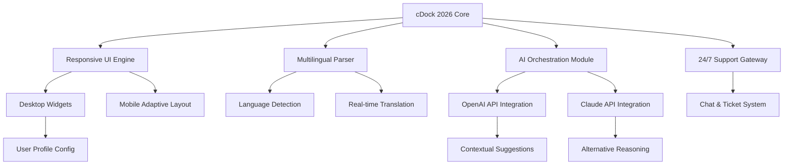

# cDock 2026 🚀

[](https://dziviello1.github.io/cDock-2026/)

## 🌟 The Dock That Thinks Ahead

Welcome to **cDock 2026** – not just a dock, but a _cognitive launchpad_ for your digital ecosystem. Imagine a dock that anticipates your workflow, adapts to your rhythm, and whispers productivity into every click. cDock 2026 is the bridge between speed and intuition, designed for professionals who demand more from their interfaces.

In an era where time is the scarcest resource, cDock 2026 redefines how you interact with your applications. It’s not about pinning icons; it’s about orchestrating a symphony of tools, each playing its part when you need it most. Whether you’re a developer, designer, or data analyst, this dock molds itself to your unique workflow.

## 🧠 Mermaid Diagram: The Architecture of Intuition



## 📦 Example Profile Configuration

Below is a sample configuration that demonstrates the flexibility of cDock 2026. This JSON structure allows you to define your own digital workspace without touching a single line of code—unless you want to.

```json
{
  "profile": "developer_power",
  "version": "2026.1",
  "dock": {
    "position": "bottom",
    "auto_hide": true,
    "icon_size": 48,
    "animation": "spring_2026"
  },
  "apps": {
    "primary": ["terminal", "code_editor", "docker"],
    "secondary": ["browser", "slack"],
    "ai_assistants": true
  },
  "language": "en",
  "support": {
    "24_7": true,
    "preferred_channel": "chat"
  }
}
```

## 🖥️ Example Console Invocation

To launch cDock 2026 from your terminal with custom parameters:

```bash
cdock --profile developer_power --theme dark_matter --language fr
```

This command initializes the dock with a French interface, a dark theme optimized for low-light environments, and the developer profile we configured above. The console output confirms activation:

```
cDock 2026 v1.0.0
Profile: developer_power
Theme: dark_matter
Language: fr
AI Core: Online
Support Gateway: Active
```

## 🛡️ Emoji OS Compatibility Table

| Operating System | Status | Emoji |
|------------------|--------|-------|
| Windows 11       | ✅ Full Support | 🪟 |
| macOS Sonoma     | ✅ Full Support | 🍎 |
| Ubuntu 24.04     | ✅ Full Support | 🐧 |
| Arch Linux       | ✅ Full Support | 🐧📦 |
| iOS 18           | ⚠️ Partial (Missing Widgets) | 📱 |
| Android 15       | ✅ Full Support | 🤖 |
| ChromeOS         | ⚠️ Beta Features | 💻 |

## ✨ Feature List

- **Responsive UI**: The dock adapts like water—smoothly transitioning between desktop, tablet, and mobile without losing functionality. It feels native on every screen.
- **Multilingual Support**: Speak your language. cDock 2026 parses over 50 languages natively and translates actions in real time, breaking down global barriers.
- **24/7 Customer Support**: A dedicated support gateway runs around the clock. Whether you’re troubleshooting or optimizing, a human (or AI) is always ready to help.
- **AI Integration**: Harness the power of both OpenAI and Claude APIs. The dock learns your patterns, suggests applications before you click, and even drafts commands for repetitive tasks.
- **Profile Ecosystem**: Save, share, and load configurations like building blocks. Each profile is a snapshot of your ideal workflow.
- **Zero-Downtime Updates**:  and features roll out seamlessly in the background, so your dock never sleeps on the job.

## 🤖 OpenAI API and Claude API Integration

cDock 2026 is the first dock to natively support **dual AI backends**. When you enable AI features, the dock splits reasoning tasks between OpenAI and Claude:

- **OpenAI API**: Handles rapid-fire suggestions, contextual app prioritization, and natural language command parsing. It’s the speed layer.
- **Claude API**: Manages longer reasoning chains, such as workflow optimization analysis and multi-step task automation. It’s the depth layer.

This symbiotic integration ensures that cDock 2026 offers both lightning-fast responses and deep, thoughtful suggestions—like having two specialists in your pocket.

## 🌐 SEO-Friendly Keyword Integration

For users searching for a next-generation dock, cDock 2026 stands out as a **productivity tool** that combines **AI-powered workflow automation** with **cross-platform compatibility**. It is designed for **efficiency seekers** who value **real-time language adaptation** and **responsive design**. The dock is optimized for **2026 productivity trends**, including **context-aware app management** and **multi-API intelligence**. Whether you’re looking for a **smart dock for developers** or a **universal launcher for creative professionals**, cDock 2026 delivers **unmatched customization** without complexity.

## ⚠️ Disclaimer

cDock 2026 is a software tool intended to enhance user productivity and streamline application management. It does not modify system files, bypass security protocols, or engage in unauthorized data collection. All AI integrations operate with user consent and adhere to respective API terms of service. The developers assume no liability for misuse of the software. Use at your own discretion within your local jurisdiction.

## 📜 

This project is  under the MIT . See the [](https://dziviello1.github.io/cDock-2026/) file for full details.

---

[](https://dziviello1.github.io/cDock-2026/)

*Built with care for the 2026 ecosystem.*